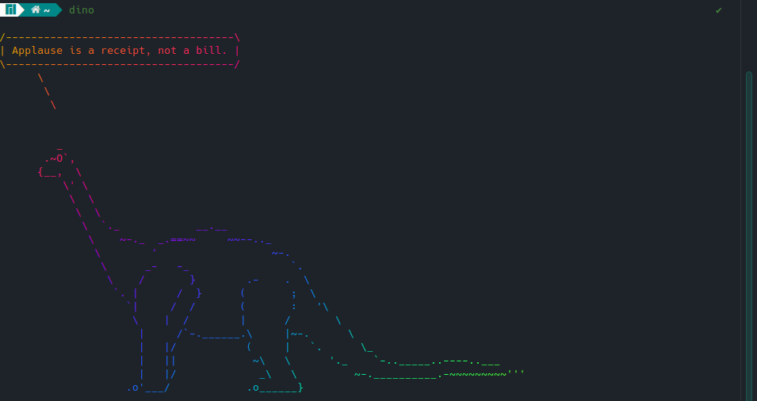

# dino_wisdom
Simple bash script to display a wise dino in rainbow colours
## Dependencies
- https://github.com/MatteoGuadrini/dinosay
- lolcat
## Installation
Download the script, put it somewhere, for example `~/.local/bin/welcome.sh` and make it executable with
```
chmod +x dino.sh
```
Then create an alias for the script (for example in `~/.bashrc`)
```
alias dino="bash /home/jstet/.local/bin/dino.sh"
```


